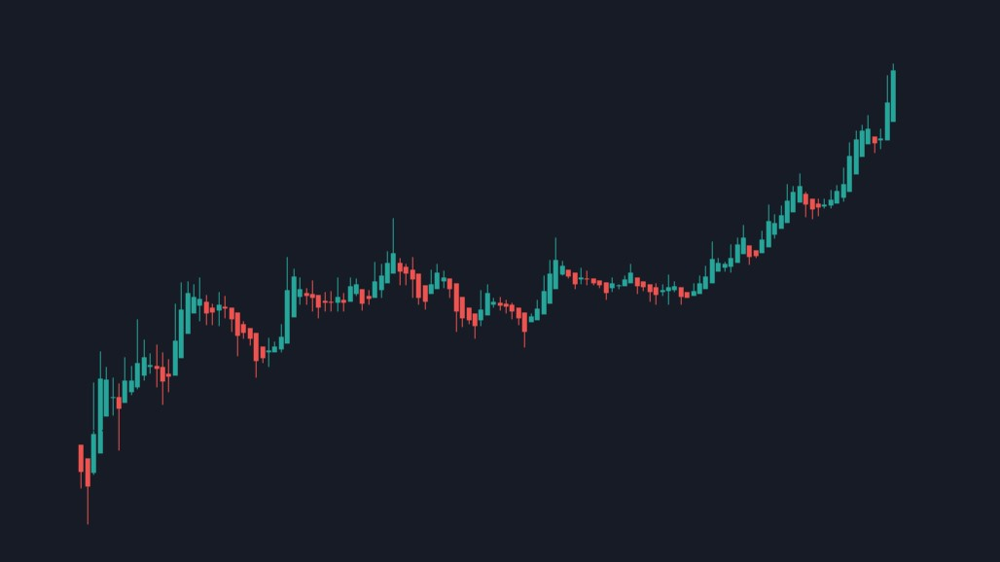

# Stock Trend Prediction with LSTM and Streamlit Web App



## Overview

This project utilizes LSTM (Long Short-Term Memory) neural networks to predict stock price trends and presents the results through an interactive web application built with Streamlit. The goal is to provide users with a user-friendly interface to access real-time stock price predictions based on historical data.

## Features

- **Data Collection:** Gather historical stock price data from reliable sources.
- **Data Preprocessing:** Clean, transform, and prepare the data for LSTM model training.
- **LSTM Model:** Develop a deep learning model using LSTM layers for time series prediction.
- **Model Deployment:** Create an interactive web application with Streamlit to showcase predictions.
- **Real-time Updates:** If desired, implement real-time data updates for the web app.
- **Visualization:** Display predictions and historical data through charts and graphs.

## Technologies Used

- Python
- Pandas for data manipulation
- Matplotlib and Seaborn for data visualization
- Scikit-Learn for data preprocessing (if applicable)
- TensorFlow and Keras for LSTM model development
- Streamlit for web application development

## Getting Started

To get started with this project using Git Bash, follow these steps:

1. Clone this repository:
    ```bash
    https://github.com/aayushsoni4/Stock-Trend-Prediction.git
    ```
2. Navigate to the project directory:
    ```bash
    cd stock-trend-prediction
    ```
3. Install the required libraries:
    ```bash
    pip install -r requirements.txt
    ```
4. Follow the notebooks in the `notebooks/` directory for detailed instructions on data analysis and LSTM model development.

5. To run the Streamlit web app, use:
    ```bash
    streamlit run app.py
    ```
